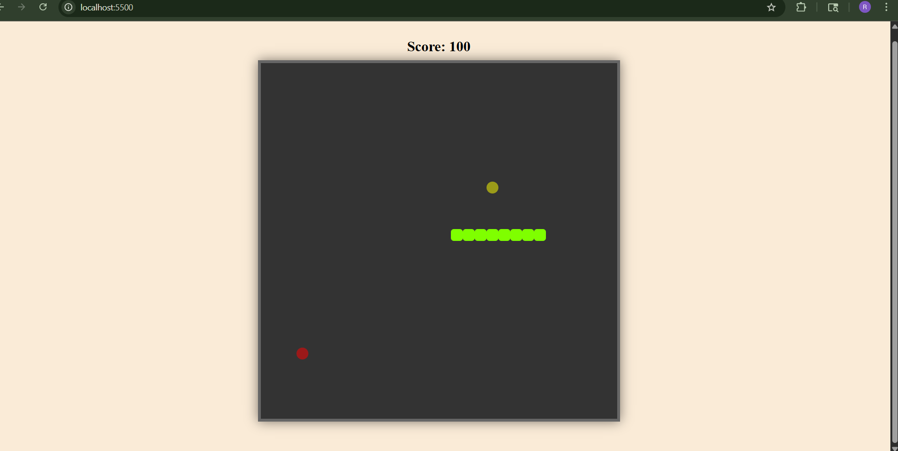

# Snake Game

This is a simple Snake Game implemented as a fun programming project. The game allows you to control a snake, eat food to grow longer, and avoid running into the walls or yourself.

## Features

- Classic snake gameplay
- Score tracking
- Responsive controls
- Simple and clean interface

## How to Run

1. Clone or download this repository.
2. This is a JS project, just install live server if you are using vscode and click on GoLive.

## Project Images

Below are some screenshots showcasing the Snake Game:

